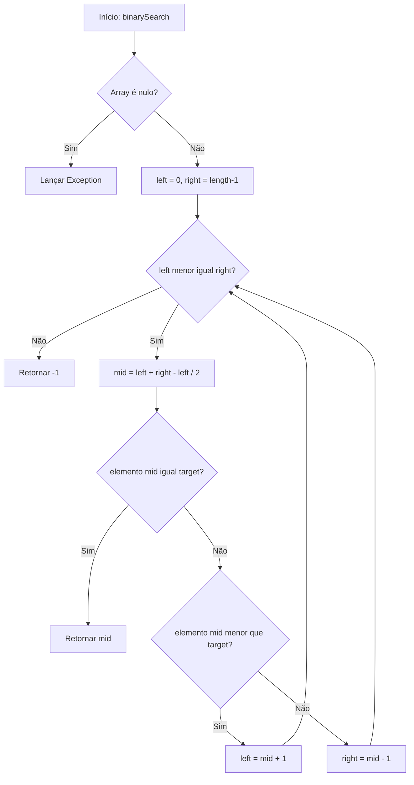

# Binary Search em Java

## 📌 Visão Geral
Implementação em Java do algoritmo de Busca Binária com:
- Código principal
- Testes unitários
- Fluxograma em Mermaid

## 📦 Estrutura do Projeto

```
binary-search/
└── BinarySearch.java
└── BinarySearchTest.java
└── pom.xml
```

## 🛠️ Como Usar

### 1. Compilar e executar testes:
```bash
mvn test
```

### 2. Implementação principal:
```java
public class BinarySearch {
    public static int binarySearch(int[] arr, int target) {
        if (arr == null) {
            throw new IllegalArgumentException("Array não pode ser nulo");
        }
        
        int left = 0;
        int right = arr.length - 1;
        
        while (left <= right) {
            int mid = left + (right - left) / 2;
            
            if (arr[mid] == target) {
                return mid;
            } else if (arr[mid] < target) {
                left = mid + 1;
            } else {
                right = mid - 1;
            }
        }
        
        return -1;
    }
}
```

## 🧪 Testes
```java
import org.junit.jupiter.api.Test;
import static org.junit.jupiter.api.Assertions.*;

public class BinarySearchTest {
    
    @Test
    public void testBinarySearchFound() {
        int[] arr = {1, 3, 5, 7, 9, 11};
        assertEquals(2, BinarySearch.binarySearch(arr, 5));
    }
    
    @Test
    public void testBinarySearchNotFound() {
        int[] arr = {1, 3, 5, 7, 9, 11};
        assertEquals(-1, BinarySearch.binarySearch(arr, 4));
    }
    
    @Test
    public void testBinarySearchEmptyArray() {
        int[] arr = {};
        assertEquals(-1, BinarySearch.binarySearch(arr, 5));
    }
    
    @Test
    public void testBinarySearchNullArray() {
        assertThrows(IllegalArgumentException.class, () -> {
            BinarySearch.binarySearch(null, 5);
        });
    }
}
```

## 📊 Fluxograma do Algoritmo Binary Search



## Exemplo Prático


## 🔍 Explicação do Algoritmo

### Complexidade:
- **Tempo**: O(log n) - divide o espaço de busca pela metade a cada iteração
- **Espaço**: O(1) - usa apenas algumas variáveis auxiliares

### Pré-requisitos:
- O array deve estar **ordenado** em ordem crescente
- Elementos devem ser comparáveis

### Passos do Algoritmo:
1. **Inicialização**: Define ponteiros para início (left) e fim (right) do array
2. **Loop Principal**: Enquanto left ≤ right:
   - Calcula o ponto médio para evitar overflow: `mid = left + (right - left) / 2`
   - Compara elemento no meio com o alvo
   - Ajusta os ponteiros conforme o resultado da comparação
3. **Resultado**: Retorna índice se encontrado, -1 caso contrário

## 🚀 Exemplo de Uso

```java
public class Main {
    public static void main(String[] args) {
        int[] numbers = {1, 3, 5, 7, 9, 11, 13, 15};
        int target = 7;
        
        int result = BinarySearch.binarySearch(numbers, target);
        
        if (result != -1) {
            System.out.println("Elemento " + target + " encontrado no índice: " + result);
        } else {
            System.out.println("Elemento " + target + " não encontrado");
        }
    }
}
```

## 📋 Dependências (pom.xml)

```xml
<?xml version="1.0" encoding="UTF-8"?>
<project xmlns="http://maven.apache.org/POM/4.0.0"
         xmlns:xsi="http://www.w3.org/2001/XMLSchema-instance"
         xsi:schemaLocation="http://maven.apache.org/POM/4.0.0 
         http://maven.apache.org/xsd/maven-4.0.0.xsd">
    <modelVersion>4.0.0</modelVersion>
    
    <groupId>com.example</groupId>
    <artifactId>binary-search</artifactId>
    <version>1.0.0</version>
    
    <properties>
        <maven.compiler.source>11</maven.compiler.source>
        <maven.compiler.target>11</maven.compiler.target>
        <junit.version>5.8.2</junit.version>
    </properties>
    
    <dependencies>
        <dependency>
            <groupId>org.junit.jupiter</groupId>
            <artifactId>junit-jupiter</artifactId>
            <version>${junit.version}</version>
            <scope>test</scope>
        </dependency>
    </dependencies>
    
    <build>
        <plugins>
            <plugin>
                <groupId>org.apache.maven.plugins</groupId>
                <artifactId>maven-surefire-plugin</artifactId>
                <version>3.0.0-M7</version>
            </plugin>
        </plugins>
    </build>
</project>
```
